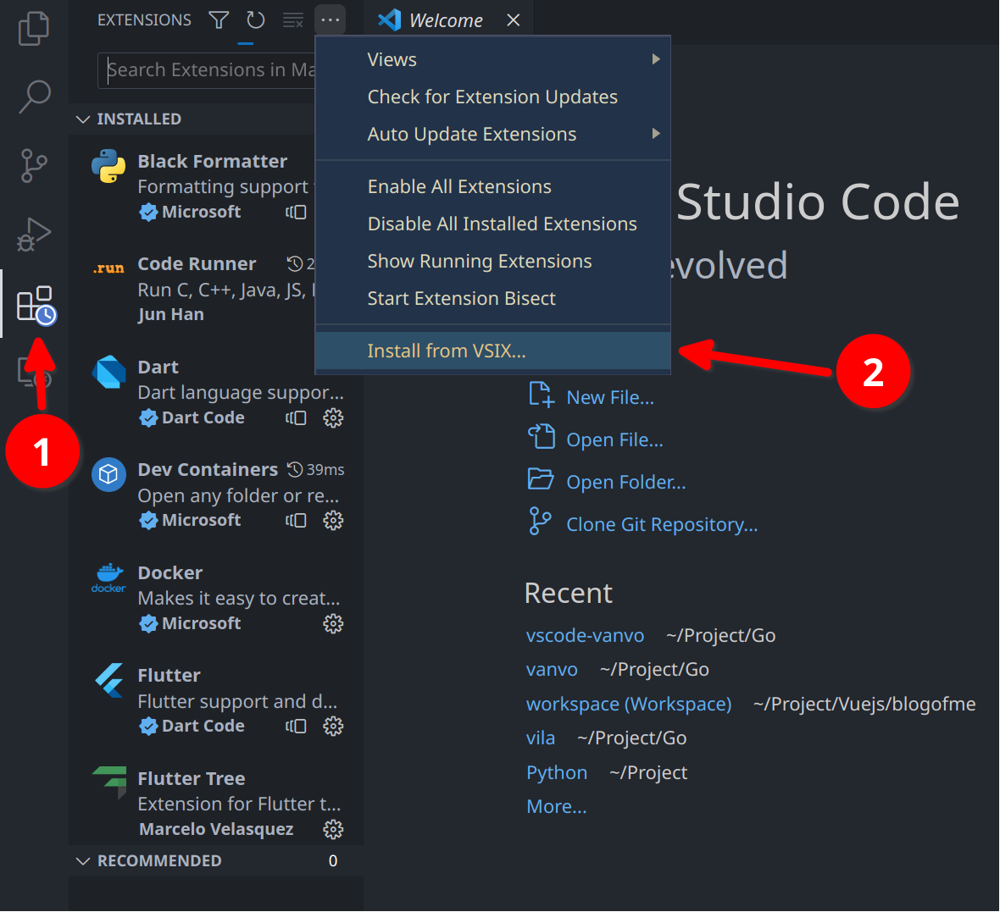
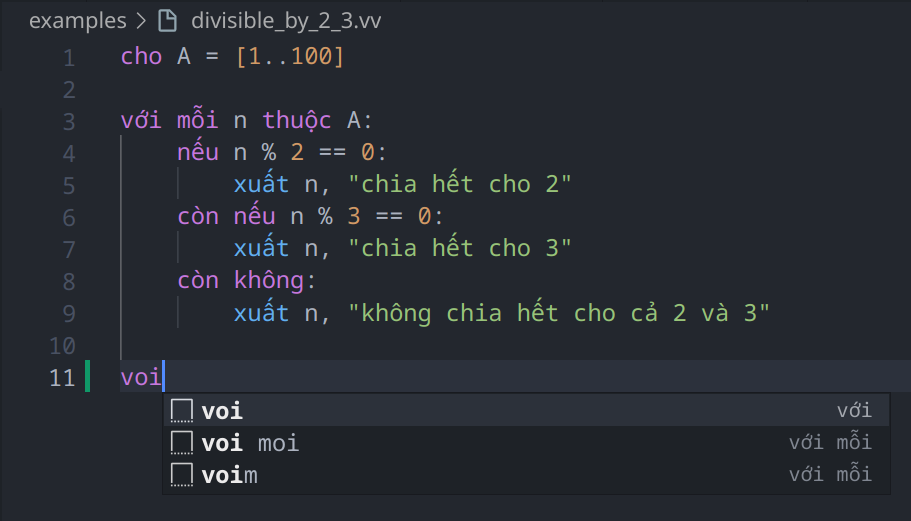

# VanVo language support for Visual Studio Code

Language support (bao gồm syntax highlight và snippets) cho ngôn ngữ [VanVo](https://github.com/balldk/vanvo) trên Visual Studio Code.

## Cài đặt

Hiện tại extension chưa được đưa lên chợ nên để cài đặt thì bạn hãy cài thủ công qua các bước sau nhé.

**Bước 1:** Tải file `.vsix` ở đây [Release v0.0.1](https://github.com/balldk/vscode-vanvo/releases/tag/v0.0.1).

**Bước 2:** Mở VSCode -> Chọn vào Extensions bên menu trái -> Chọn dấu ... -> Chọn Install from VSIX (như hình dưới)

**Bước 3:** Chọn file `.vsix` vừa mới tải về.

Sau các bước trên thì về nguyên tắc những file có đuôi `.vv` sẽ được highlight và có snippets như hình minh họa

Nếu có bất kì trục trặc nào thì bạn có thể tạo issue hoặc liên hệ với mình nhé.